# 🏰 Arsenal Strategic Attack Tree

```mermaid
graph TD
    A[Strategic Goal: Compromise Showpad Platform] --> B1[Compromise Credentials]
    A --> B2[Exploit Application Vulnerabilities]
    A --> B3[Attack Cloud Infrastructure]
    A --> B4[Compromise Client Environment]
    A --> B5[Exploit Third-Party Dependencies]
    
    B1 --> C1[Phishing/Social Engineering]
    B1 --> C2[Credential Stuffing]
    B1 --> C3[Password Spraying]
    B1 --> C4[Session Hijacking]
    B1 --> C5[Insecure SSO/SAML Implementation]
    
    B2 --> C6[Injections: SQL, NoSQL, Command]
    B2 --> C7[Broken Access Control]
    B2 --> C8[Business Logic Flaws: Content Sharing]
    B2 --> C9[File Upload Vulnerabilities]
    B2 --> C10[XSS/CSRF in Admin Panels]
    B2 --> C11[API Security Flaws]
    
    B3 --> C12[Cloud Misconfiguration]
    B3 --> C13[Container/Orchestration Exploits]
    B3 --> C14[Server-Side Request Forgery]
    B3 --> C15[Cloud Metadata Service Exploitation]
    
    B4 --> C16[Malicious Browser Extensions]
    B4 --> C17[Client-Side Supply Chain Attacks]
    B4 --> C18[Local Storage Data Extraction]
    
    B5 --> C19[Vulnerable Libraries/Frameworks]
    B5 --> C20[Compromised Analytics/Tracking Scripts]
    B5 --> C21[Third-Party Service Takeover]
    
    C1 --> D1[Spear Phishing Employees]
    C1 --> D2[Clone Login Pages]
    C3 --> D3[Target Weak MFA Implementation]
    C6 --> D4[Exfiltrate Customer DB]
    C8 --> D5[Bypass Content Sharing Restrictions]
    C9 --> D6[Upload Web Shell]
    C12 --> D7[Exposed S3 Buckets/Storage]
    C14 --> D8[Access Internal Services]
    C17 --> D9[Compromise via NPM/JS Packages]
    C21 --> D10[Hijack CDN/DNS Records]
    
    D1 --> E1[Initial Access]
    D4 --> E2[Data Theft]
    D6 --> E3[Persistence]
    D8 --> E4[Lateral Movement]
    D10 --> E5[Service Disruption]
    
    style A fill:#f9f,stroke:#333,stroke-width:4px
    style B1,B2,B3,B4,B5 fill:#bbf,stroke:#333,stroke-width:2px
    style E1,E2,E3,E4,E5 fill:#f96,stroke:#333,stroke-width:2px
```

## Reasoning
As a Chief Security Architect analyzing showpad.com, a sales enablement platform handling sensitive enterprise content, I've constructed this attack tree focusing on high-value targets and realistic vectors. The tree prioritizes: 1) Credential attacks (primary initial vector for SaaS platforms), 2) Application-layer attacks specific to content sharing and file management, 3) Cloud-native attack paths given their AWS/Azure infrastructure, 4) Client-side attacks targeting sales teams' browsers, and 5) Supply chain risks from numerous third-party integrations. Business logic attacks are emphasized due to the complex sharing, permission, and workflow features. The tree reflects modern SaaS multi-tenancy risks, where compromising one tenant could impact others through platform vulnerabilities. Cloud misconfigurations are weighted heavily based on industry patterns for similar platforms. Each leaf node represents a concrete, actionable attack path requiring specific security controls for mitigation.